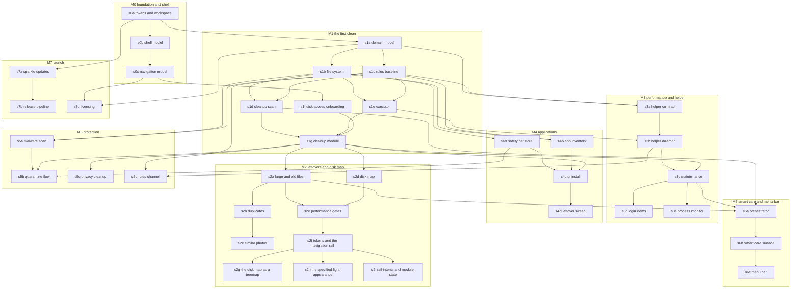

# Dependency Graph: MacGleam

Companion to CONTRACTS.md. Slices are thin vertical paths of user value,
mapped onto milestones M0 to M7 from ROADMAP.md. Each slice is sized so one
agent completes it within half a fresh context window. Contract numbers (C1 to
C39) refer to CONTRACTS.md.

Reading a slice entry:

- Depends on lists only real dependencies: the slice's tests cannot pass
  without them. Transitive dependencies are not repeated.
- Verification names the behaviour a test proves when the slice is done.
- Tier is auto (tests passing fully captures correctness) or verify (a human
  checks the named behaviour on a real machine before the slice closes).
  Every interface slice is verify because interaction quality is the product.

## Dependency diagram

Validated with the mermaid command line renderer on 2026-08-11.

The first wave (no dependencies beyond s0a) is wide on purpose: s0b, s1a and
s7a can start in parallel the moment the workspace exists.

---

## M0. Foundation and the shell

The two interface slices here shipped as the hexagonal hub. The rail replaced
that surface in s2f, so their entries below describe what survives, and their
human checks are retired without a verdict rather than left standing against a
screen nobody can open. DECISIONS.md carries the reversal and its reasons.

### s0a. tokens and workspace
- Contracts: C1, C2.
- Depends on: nothing.
- Includes the repo cut, the Swift package workspace and continuous
  integration with test and lint gates, folded in because infrastructure
  alone is not a slice.
- Verification: token values match the contract exactly (spring responses,
  damping, fade durations, grid unit); semantic colours pass the Web Content
  Accessibility Guidelines AA contrast threshold in both appearances; the
  Reduce Motion mapping returns a crossfade, never a spring; continuous
  integration runs the suite on a macOS runner and fails on an empty test run.
- Tier: auto.

### s0b. the shell model (shipped as the hub shell)
- Contracts: C36 (hub shell model), consuming C1, C2.
- Depends on: s0a.
- What survives: the model. The hexagon of six cards around a centre orb was
  deleted in s2f; the moods, the status line, the module summaries and the orb
  appearance resolver were not, and the rail's health light is the orb.
- Verification: the orb renders its two idle states (healthy, attention
  needed); mood, status line and summary derivation are pure functions of
  HubMachineState, driven in tests without any view; the appearance resolver
  is total over every mood and Reduce Motion pair and never returns a spring
  under Reduce Motion; the module order is the fixed HubModule order.
- Tier: was verify; the human check is retired without a verdict, because the
  hexagonal layout it asked about no longer exists (STATE.md). The orb's
  breathing and the two appearances carried into s2f's check. What is left of
  this slice stands on tests alone.

### s0c. the navigation model (shipped as the hub zoom)
- Contracts: C37, which this slice wrote as the hub navigation model and s2f
  rewrote as the rail navigation model. Consumes C1, C2, C36.
- Depends on: s0b.
- What survives: the navigation model and the zoom resolver. The card to
  module matched geometry zoom went with the hexagon in s2f; the zoom grammar
  itself did not, because Disk Map drills into folders with it (C39). s2f
  rewrote the rest of C37 into the rail. The slices downstream that depend on
  s0c depend on there being a navigation surface at all, which is why the edge
  outlives the zoom.
- Verification: the key transition is total and deterministic and drives every
  destination without a view; module state passes through untouched over any
  key sequence; Reduce Motion replaces the zoom with a crossfade and the zoom
  resolver never returns a spring under it.
- Tier: was verify; the human check is retired without a verdict, because the
  hub to module zoom it asked about no longer exists (STATE.md). The surviving
  zoom is judged where it is still used, in s2d and s2g.

## M1. The first clean

### s1a. domain model
- Contracts: C3, C4, C5, C6, C7, C8, C9, C10, C11, C12 (types and their
  invariants; no protocols implemented yet).
- Depends on: s0a.
- Verification: path normalisation and descendant checks; counter
  monotonicity; plan and confirmation matching rules; denylist pattern
  matching including descendant blocking; all types round trip through
  Codable losslessly.
- Tier: auto.

### s1b. file system
- Contracts: C13, C14, plus the in memory implementation every engine test
  uses and the real enumerator.
- Depends on: s1a.
- Verification: the in memory and real implementations pass one shared
  conformance suite; enumeration never yields a duplicate (volumeID, fileID)
  pair even when the platform repeats entries (the Sequoia regression test,
  driven by a repeating fake); inaccessible directories are reported, not
  thrown; cancellation stops promptly and mutates nothing; moves are atomic
  per item.
- Tier: auto.

### s1c. rules baseline
- Contracts: C19 (baseline load and signature verification), completing C10.
- Depends on: s1a.
- Verification: the embedded baseline loads and verifies; a tampered
  catalogue is rejected and current rules are untouched; a lower or equal
  version is rejected; the effective denylist is the union of baseline and
  catalogue and can never lose a baseline entry.
- Tier: auto.

### s1d. cleanup scan
- Contracts: C15, C20.
- Depends on: s1b, s1c.
- Verification: against fixture trees the engine finds each junk category
  with itemised paths; nothing risky is preselected even when a hostile
  catalogue says preselectable; degraded mode reports what was skipped;
  phases advance in order and counters only count up; scanning holds only
  the reading side of the file system.
- Tier: auto.

### s1e. executor
- Contracts: C16, C17 (user domain execution; helper routing lands in s3b).
- Depends on: s1b, s1c.
- Verification: operations run in order, atomically per item; a denylisted
  target is skipped and reported as such; a permanent plan without a
  matching confirmation is refused whole before anything runs; cancellation
  between items leaves completed items completed and reports exactly which
  is which; the report always arrives, whatever happened.
- Tier: auto.

### s1f. disk access onboarding
- Contracts: C32.
- Depends on: s0c.
- Verification: the flow advances by itself when the grant lands (driven by
  a fake monitor in tests); declining lands in degraded mode with the honest
  banner naming what is unavailable; the app never prompts on a schedule.
- Tier: verify. Human check: grant Full Disk Access in System Settings and
  watch the flow advance without touching the app.

### s1g. cleanup module
- Contracts: C38 (cleanup module model), wiring C15, C17, C20, C32, C35
  into the interface. Also implements C35 (settings store) since deletion
  mode is first exercised here.
- Depends on: s1d, s1e, s1f.
- Verification: the full first clean end to end against a fixture home:
  scan, review down to file paths, deselect, execute, result screen naming
  every outcome, files present in the Trash afterwards; empty state is the
  designed clean sweep, not a blank panel; permanent mode demands the counts
  confirmation. Carried through to what the user sees next: after execution
  the hub estimate reflects the reclaimed bytes.
- Tier: verify. Human check: run a real clean on a scratch account, restore
  a file from the Trash, confirm the choreography (staggered rows, fly to
  summary, ticking counter) uses only token motion.

## M2. Leftovers and Disk Map

M2 also carries the interface slices that landed with it: s2f to s2i, which
replaced the hub with the rail, the disk map with a treemap, and the derived
light appearance with a specified one. They were appended under M3 by the pull
requests that shipped them; they belong here, with the milestone whose work
they were done alongside.

### s2a. large and old files
- Contracts: C21 (large, old, downloads triage portions).
- Depends on: s1g.
- Verification: threshold edges are exact (threshold minus one byte or day
  is not a finding); thresholds honour Settings; downloads triage groups by
  the review rules; end to end removal through the shared executor lands in
  Trash.
- Tier: verify. Human check: the Leftovers module surface reads as the same
  design language as Cleanup.

### s2b. duplicates
- Contracts: C21 (duplicate sets).
- Depends on: s2a.
- Verification: sets group by full content hash, never by size alone; the
  kept copy is a member of every set, shown in review, and no generated plan
  targets it under any selection, attacked with hostile selections; at least
  one copy always survives.
- Tier: verify. Human check: resolve a duplicate set and confirm the kept
  copy is visibly named before anything moves.

### s2c. similar photos
- Contracts: C21 (similar photo sets).
- Depends on: s2b.
- Verification: sets contain only image files and never overlap; kept path
  mechanics identical to duplicates; non photo libraries produce no sets.
- Tier: verify. Human check: grouping quality on a real photo folder is
  useful rather than noisy.

### s2d. disk map
- Contracts: C22, C39 (disk map module model). Amends C5 (per path byte
  sizes on Finding) and the C6 and C21 wording that followed, retiring the
  s2b ScannedAllocationCache.
- Depends on: s1g.
- Verification: the map streams and node totals only ever grow, converging
  to true allocated totals; denylisted nodes render but cannot be selected;
  deleting from the map follows the Trash default through the shared
  executor; drill in uses the shared zoom grammar (the C37 appearance
  types); finding byte totals derive from the finding's own entries with no
  process wide cache; the s1a Finding pins named in C5's migration note are
  updated deliberately in this slice.
- Tier: verify. Human check: the map builds outward from the root while
  scanning, and drilling into a folder is one continuous motion rather than a
  cut. The hub this zoom was shared with is gone; the grammar is not, and the
  Disk Map is now the only place it runs.

### s2e. performance gates
- Contracts: amends C4 (itemCount), C5, C15 (ScanStreamPolicy, the streaming
  guarantee), C20, C21, C22 and C38 so findings stream as bounded batches;
  enforces the performance and streaming clauses of C20 and C22.
- Depends on: s2a, s2d.
- Verification: on a generated fixture of typical shape, the full Cleanup
  scan finishes under 60 seconds and the Disk Map under 30 on Apple
  silicon; peak resident memory during the largest scan stays under 500
  megabytes; the first finding and the first map node each arrive within two
  seconds of their run starting and within the first half of it; no finding
  carries more than ScanStreamPolicy.maximumFindingEntries entries; a
  fixture crossing ScanStreamPolicy.firstFindingCheckpointFiles proves a
  sparse category streams its first finding mid walk rather than at the end;
  a category's paths, file count and byte total are the sums across its
  findings; the gates run in continuous integration and fail on regression.
  The C15 migration note lists the existing pins this breaks.
- Tier: auto.

### s2f. Lumina tokens and the navigation rail
- Contracts: rewrites C1 (the Lumina Utility palette, eight text roles, three
  nested radii, elevation with real values, the 4 point half step) and C37
  (HubDestination, the rail resolver, ModulePane and its resolver). Renames
  C36's HubCard to HubModuleSummary and cardFigures to moduleFigures.
- Depends on: s2e.
- Verification: every specified colour resolves to its hex; every text role
  carries its size, tracking and line height; the rail reaches every
  destination with up and down alone and clamps at both ends; left and right
  no longer move the selection and no transition carries a zoom; a pane
  carries an action exactly when its module is built and a not ready note
  exactly when it is not; the module's live figure lands on its first job and
  nowhere else.
- Tier: verify. Human check: the rail and the pane read as one app, and every
  module opens on the same shape.

### s2g. the disk map as a treemap
- Contracts: adds TreemapLayout to C39's module surface.
- Depends on: s2f.
- Verification: tile area matches weight share; tiles never overlap, stay
  inside the canvas and tile it exactly; a small entry beside a dominant one
  keeps both a width and a height; equal weights come out close to square.
- Tier: verify. Human check: a folder holding almost everything no longer
  hides the rest, and drilling in from a tile feels the same as from the list.

### s2h. the specified light appearance
- Contracts: amends C1 (light values come from the Clinical Precision
  specification; GleamElevation becomes appearance aware and returns an edge
  colour and a shadow rather than bare numbers).
- Depends on: s2f.
- Verification: every specified light token resolves to its hex; no token is
  the same colour in both appearances; a resting card casts nothing in dark
  and something in light; each appearance's named shadows match; a light
  shadow is cast in the text navy and a dark one in black.
- Tier: verify. Human check: the light appearance reads as deliberate rather
  than as the dark one with the lights turned up.
- Two of those five had no test at the 2026-08-11 reconciliation, so they were
  not read as done: light was not asserted hex for hex the way dark is, resting
  instead on the contrast matrix, the named shadows and the named edge, and
  nothing asserted that a token differs between the two appearances. Both are
  unfinished verification of shipped values, not unfinished values. Both were
  closed on 2026-08-11: light is now pinned hex for hex where the specification
  names a value and pinned as a shipping value where it does not, and a test
  asserts no token resolves to the same colour in both appearances.

### s2i. the rail's intents and preserved module state
- Contracts: C37 (HubIntent reaching the pane, ModuleStateSlot and
  storingSlot), consuming C38 and C39 for the panes that act on an intent.
- Depends on: s2f.
- Why it exists: C37 specified both and neither was wired. The resolver
  returned an intent for return and escape and nothing read it, so the shell
  consumed both keys and did nothing with them; `storingSlot` had no caller
  outside the tests, so module state did not survive navigation. The first was
  a live defect a keyboard only user hit, closed on 2026-08-11 through
  `HubKeyResolver`, which claims a press only when it moves the rail or
  carries an intent the open pane can run. The module state half closed on
  2026-08-12 through `ModuleStateExchange`, the one function every rail move
  goes through.
- Verification: return over a built module runs that pane's primary action and
  escape dismisses whatever the pane has open, both driven through the shell
  rather than asserted at the resolver; a key the open pane does not use is
  reported unhandled rather than swallowed, so the system beep and the
  responder chain still work; leaving a module and coming back restores what
  the module put in its slot, with the round trip carried to what the user
  sees next rather than stopping at the store: a category folded away in the
  Cleanup review is still folded when the rail comes back, proved against a
  freshly built presentation because that is what the rail hands the user; a
  module with nothing to preserve stores nothing and is unaffected. Disk Map
  is rail chrome rather than a module, so C39 gives it no slot; what is proved
  for it instead is that a walk through the rail leaves the drilled in folder,
  the selection and the map's usability exactly as they were, and writes no
  slot for it. GRAPH.md previously asked for a slot round trip on Disk Map,
  which C39 rules out; the contract wins and this entry is corrected.
- Tier: verify. Human check: drive the whole app with the keyboard alone,
  starting a scan and dismissing a result without touching the pointer, and
  confirm a review selection survives navigating away and back.

## M3. Performance and the privileged helper

### s3a. helper contract
- Contracts: C30, C31 (types, policy, contract tests against a test double
  transport). Also lands C24's LaunchItemChange in GleamCore as a plain value
  type, because C30's launchItemChanged reply carries it; the behaviour around
  it stays in s3d.
- Depends on: s1a, s1c.
- Verification: every message round trips the wire encoding losslessly; the
  policy refuses in the contract's evaluation order (identity, handshake,
  domain, denylist) with the right refusal each time; a user domain target
  is refused notSystemDomain; a denylisted target is refused whatever the
  request claims; version mismatch refuses everything after handshake, and
  the handshake refusal names both versions so the app can say which side is
  behind; a request arriving before any handshake is refused versionMismatch;
  a launch item the helper cannot resolve is refused malformedRequest.
- Tier: auto.

### s3b. helper daemon
- Contracts: implements C30, C31 in the real daemon; extends C17 with helper
  routing.
- Depends on: s3a, s1e.
- Verification: contract tests pass against the real daemon on a real
  machine; the executor routes systemDomain operations to the helper and
  validates replies; a malformed reply fails the one operation, not the run;
  the helper is registered lazily on first privileged need, never at first
  launch.
- Tier: verify. Human check: first privileged operation triggers the System
  Settings approval exactly once, and the app degrades honestly if approval
  is refused.

### s3c. maintenance
- Contracts: C23 (maintenance portion), first real helper consumer;
  amends C5 (a maintenance finding carries no path entries, plus the
  `maintenanceTask` category), C4 (itemCount for a pathless finding),
  C7, C15 and C29.
- Depends on: s3b, s1g.
- Verification: each maintenance task runs through the helper and is
  idempotent; tasks that clear user visible data say so before running; no
  PerformanceEngine plan ever contains a file removal operation; a
  maintenance finding carries no path entries, so its `paths` is empty
  and its `byteSize` is zero, asserted over every MaintenanceTask case
  and over the whole generated plan space rather than over the tasks a
  test happens to name; no finding whose task has `clearsUserVisibleData`
  true is ever preselected and no Full Sweep plan ever contains one,
  asserted over the flag so a task added later is covered without a new
  test.
- Tier: verify. Human check: the Domain Name System cache flush arrives
  deselected, and running it deliberately shows the warning sentence
  first.

### s3d. login items
- Contracts: C24, C23 (login item portion). LaunchItemID and LaunchItemChange
  already exist as value types (s1a, s3a); this slice gives them behaviour.
  C24 also declares the four boundaries it had only referred to (the
  inventory source, the two changing sides, the store of prior state) and its
  error type. Amends C5 (the `launchItem` category, and the pathless rule
  stated over the Performance module rather than a list of cases), C30
  (attribution on setLaunchItemEnabled, correlationID on every reply,
  contract version 2) and C17 (launch item operations go to C24 rather than
  being routed by path ownership).
- Depends on: s3c.
- Verification: inventory attributes items to owning apps; disable then re
  enable round trips through the recorded prior state and survives relaunch;
  user scope changes stay in process, system scope routes through the
  helper; disable never deletes; every privileged change is attributable and
  none can be made without an attribution, which is structural rather than
  asserted (ChangeAttribution has no empty case, the manager's parameter has
  no default, and C30's request cannot be built without one, so the
  unattributed call does not compile); a planned change carries the plan and
  the operation the executor is running; a switch flipped in the interface
  carries a change identifier that appears in no plan and in no
  ExecutionReport, asserted by minting one and searching both for it, so a
  direct toggle is attributable to itself rather than to a plan that never
  existed; the helper echoes whichever it was as the reply's correlationID,
  so a refusal reconciles one to one for both kinds.
- Tier: verify. Human check: disable a known login item, log out and in,
  confirm it did not launch, re enable with one click.

### s3f. the helper contract at version two
- Contracts: C30 (the message set moves to version 2), C24, C31.
- Depends on: s3d.
- Why it exists: C24 decided that every privileged launch item change carries
  a `ChangeAttribution`, and the manager and the executor honour that today.
  The wire does not. Putting the attribution on C30's request and renaming
  every reply's `operationID` to `correlationID` breaks seven helper test
  files at compile time, so the helper suites move to version 2 first and the
  migration lands as its own change rather than riding inside a login item
  slice. Until it does, no privileged launch item change has a production
  path, so nothing is unattributed in practice; the gap opens the moment one
  is wired, which is what makes this a prerequisite rather than a tidy up.
- Verification: `HelperContract.version` is 2 and both processes compile
  against the one declaration; a `setLaunchItemEnabled` request cannot be
  constructed without an attribution; a direct change's identifier appears in
  no plan and in no `ExecutionReport`; every reply echoes the correlation
  identifier of the request that caused it, for a planned operation and for a
  direct change alike; a version 1 client is refused with both numbers named.
- Also landed here, because the promise had nowhere to be proved otherwise:
  deciding which reply answers which request moved out of the daemon, an
  executable target no test links, into `HelperReplyRouter` in the shared
  package. And `HelperClient` became the production
  `PrivilegedLaunchItemChanging`, so the attribution has an actual path to the
  wire; until this slice there was none, which is what kept the gap theoretical.
- Tier: auto. Done 2026-08-12.

### s3e. process monitor
- Contracts: C25, amended in this slice on five points, each a contract change
  rather than an implementation choice: `quit` takes a `QuitConfirmation`
  value rather than an identifier, a name and a `force` flag; the name lookup
  moves onto the signalling boundary beside the terminate rather than sitting
  with the listing; the sampling cadence becomes an injected boundary; the
  heaviest first ordering breaks ties by the lower process identifier; and a
  snapshot the machine refuses is skipped rather than repeated. C25 also
  declares the three boundaries it had only described (`ProcessListing`,
  `ProcessTerminating`, `ProcessSampleCadence`) and writes the recycled
  identifier guarantee out in full, including the part it does not promise.
  Nothing implemented C25 before this slice, so none of it migrates.
- Depends on: s3c.
- Verification: nothing is read before the first tick and one snapshot is
  taken per tick, so the view reads the machine when a sample is due and never
  speculatively; the stream finishes when the cadence does and a cancelled
  consumer ends the sampling loop, with ticks after it reading the machine no
  further times. Every snapshot arrives heaviest first with ties broken by the
  lower process identifier, asserted over generated machines drawn from a
  handful of footprint buckets so most rows are ties, and the same processes
  reported in any order produce one order on screen; sorting drops nothing,
  invents nothing and edits no field. Monitoring signals nothing and reads no
  name for a whole run, which is structural rather than asserted alone: the
  sampling loop holds `ProcessListing`, which declares one method and it
  reads, so a sampler that could end a process does not compile. The machine
  is never read on the main actor and the sampler makes progress while the
  main actor is held in a loop, which is the assertion that fails against a
  monitor isolated to the main actor and passes against one that samples off
  it; quitting from the main actor reaches the machine off it too. A snapshot
  the machine refuses is skipped and the view carries on, with the failed tick
  attempted rather than passed over, and a machine with nothing running yields
  an empty snapshot rather than no snapshot. `quit` accepts only a
  `QuitConfirmation`, and a force quit needs its own: no sequence of quit
  confirmations, over every process on the fixture machine in any order,
  produces a force signal, and repeating a quit against a process that ignores
  the polite signal repeats that answer rather than escalating; the escalation
  is unwritable rather than untested, since the kind has no setter and the
  memberwise initialiser is not public. A confirmation cannot be decoded from
  bytes, so none can be stored or replayed. The live name is read from the
  signalling boundary immediately before the signal and the two land in that
  order on one journal, so the check is asserted as an ordering; a recycled
  identifier is refused naming both the confirmed process and the one holding
  the number now, nothing is signalled, no retry follows, and the process that
  inherited the identifier is still running afterwards. The check reads the
  machine rather than the snapshot the row was drawn from, proved by taking a
  real sample, recycling the identifier under it and confirming exactly what
  the row said. Comparison is exact over a matrix of every confirmed name
  against every live name for both kinds of confirmation, near misses
  included, so case, surrounding whitespace, a prefix and an empty name are
  all mismatches and a signal goes out exactly when the two names are equal; a
  vacant identifier is refused for every name, so a missing name is never read
  as no objection. Both failure paths fail closed: a name the machine will not
  give up refuses the quit and signals nothing, and a signal the machine
  refuses surfaces as `notPermitted` in a plain sentence naming the process,
  with that process still running. Two processes sharing a name are two
  processes: quitting one leaves the other running. The monitor is not a
  `GleamEngine` and not a `PlanExecuting`, so nothing routes the live view
  into a plan, and a `ProcessSample` carries no path, so C5's pathless rule
  holds here by the shape of the data.
- Tier: verify. Human check: the live view updates smoothly and reads in a
  stable order rather than shuffling equal rows between ticks; quitting a test
  process names it in the confirmation; and a process that ignores the polite
  signal asks a second, separate question before it is forced.

## M4. Applications

### s4a. safety net store
- Contracts: C18 in full. Amends C13 (adds `posixPermissions(at:)`, without
  which the store is required to restore a mode it cannot read), C14 (adds
  `writeData(_:to:)`, without which the manifest cannot be written through the
  injected file system at all), C8 (`FileMetadataSnapshot` loses
  `ownerAccountName`, which nothing could read, write or restore) and C18
  itself on five points: the expiry boundary, the purge byte basis, restored
  items and purging, `restoreGroup` on an unknown group, and the manifest as a
  requirement rather than an implementation detail.
- Depends on: s1b.
- Verification: store strips execute permission and preserves extended
  attributes; restore reinstates path, permissions, attributes and dates
  exactly (fidelity asserted attribute by attribute), including modes
  `FileRecord.isExecutable` cannot tell apart, so 0o755 and 0o700 each come
  back as themselves and a 0o600 payload does not return as 0o644; an occupied
  origin refuses and changes nothing; group restore is all or nothing;
  `restoreGroup` throws `groupNotFound` for an identifier no item carries and
  `alreadyRestored` for a group whose items have all been restored, and
  neither moves anything; expiry marks eligibility only and purge demands
  matching counts; an item whose `expiresAt` equals the instant asked about is
  eligible, asserted at the instant itself and not only one second either side
  of it, which is the case the suite as first written left open; a purge whose
  `byteTotal` is the allocated total of the stored payloads is accepted and
  one a byte out is refused, with a directory payload counted as its subtree
  total; a restored item never appears in `purgeEligibleItems` whatever its
  dates, and purging one throws `alreadyRestored` and changes nothing; `purge`
  rejects an unknown or restored identifier before it looks at the counts, so
  a caller with both problems is told about the identifiers first; the
  manifest is readable through the same file system at a path inside the store
  directory, and a second store constructed over that file system and that
  directory lists everything the first one wrote, which is the reinstall
  survival guarantee in its testable form; the manifest survives simulated app
  removal and reinstall. The two file system additions join s1b's shared
  conformance suite, real implementation and fake alike: a permission mode
  reads back exactly and an absent path throws rather than defaulting; a write
  replaces contents whole, is visible through C13 immediately, and throws
  `notFound` for a missing parent instead of creating one. The surface split
  test gains both on their own side, reading and writing.
- Tier: auto.

### s4b. app inventory
- Contracts: C9, C26 (inventory portion).
- Depends on: s1b, s1c.
- Verification: discovery against fixture bundles finds the app and each
  leftover kind; the association rule survives the adversarial fixtures
  (shared containers, colliding bundle identifier prefixes) without a single
  false association; MacGleam itself is never offered.
- Tier: auto.

### s4c. uninstall
- Contracts: C26 (uninstall), consuming C18.
- Depends on: s4a, s4b, s1g.
- Verification: an uninstall plan contains only archive operations under one
  group; after execution every file sits in SafetyNet and the app is gone;
  group restore reinstates every file at its original path; no uninstall
  plan can contain a trash or permanent operation.
- Tier: verify. Human check: uninstall a scratch app, watch the gather
  choreography present it as one reversible unit, restore it, launch it.

### s4e. the store sizes what it stored
- Contracts: C8, C13, C18.
- Depends on: s4a, s4c.
- Why it exists: found on 2026-08-11 while proving s4c's directory handling.
  C18 strips execute from a stored payload so a quarantined bundle cannot run
  from the store. On a real disk, stripping execute from a DIRECTORY removes
  traversal, so the store can no longer read inside its own payload: sizing a
  directory payload yields nothing and throws permissionDenied. The in memory
  file system does both happily, which is why nothing failed. Restore is
  unaffected, because a rename needs permission on the parent rather than on
  the directory being moved, so every s4a and s4c test passes and the human
  check works. Purge is where it bites, and C18 is explicit that a payload
  whose size cannot be read must fail the purge rather than count as zero, so
  today the choice is a mismatch nobody can satisfy or deleting a bundle while
  reporting nothing reclaimed.
- The fix, decided: the item records its allocated size at the moment it is
  stored, measured BEFORE the execute strip, and purge sums the recorded sizes
  rather than re-reading the store. That keeps the containment (a stripped
  directory stays unreadable) and makes the byte total exact and cheap, since
  the size of what was stored is a fact about the store rather than something
  to recompute. The alternative, not taken, was to stop stripping execute from
  directory payloads, which would trade a real containment guarantee for an
  arithmetic convenience.
- Recorded in the contracts on 2026-08-11, before the slice: C8 gains
  `allocatedBytes`, a fact recorded once at store time and never recomputed;
  C13 states that a directory without execute cannot be traversed and that
  every implementation answers that way; C18's byte total is the sum of the
  recorded sizes, its store clause measures before the move and refuses a
  payload it could not measure whole, and its KNOWN DEFECT annotation is gone
  because the contract no longer asks for a reading the disk cannot give.
  Nothing migrates; no build has been distributed and no manifest has ever been
  written outside a test. Landed 2026-08-11 in atlantic-blue/macgleam#30: the
  store records the size at store time, purge sums recorded sizes, and the fake
  refuses to traverse a stripped directory. What it could not know is that the
  purge it taught to compute the right total still cannot delete a contained
  directory payload, which is the second defect carried by s4f.
- Verification: the shared conformance suite gains the case that hid this, so
  stripping execute from a directory behaves identically in the fake and on
  the real disk; a stored directory payload records its allocated size at
  store time; a payload the walk could not read whole is refused rather than
  stored against a short figure; a purge of an uninstall archive names the true
  byte total and never zero, and sizes nothing while doing it; the fake cannot
  pass a case the real disk fails.
- Tier: auto.

### s4f. the helper archives into the store, not beside it
- Contracts: C18, C30, C31, and one clause each in C14 and C17.
- Depends on: s4e, s3f.
- Why it exists: found on 2026-08-11 while amending C18 for s4e. No
  `SafetyNetStore` is constructed in production code at all. The app builds the
  store directory path and hands it to the helper as a removal destination, and
  the helper moves the payload straight into that directory's root: no manifest
  entry, no execute strip, no recorded size. So a privileged archive is
  invisible to the store. It is not listed, not restorable, not purgeable and
  not contained, which is every guarantee C18 exists to make, absent on exactly
  the path that handles the files a person cannot remove themselves.
- Why it is worse than it looks: the reversibility promise is the product's
  whole trust position, and it currently holds for nothing at all. The user
  process path is wired to no store either, so a user domain archive fails with
  the sentence about the store not being available in this build, while the
  privileged path succeeds and records nothing. One of those fails safe and the
  other fails silent, and it is the privileged one that fails silent.
- Nothing has ever been archived, which is why this costs no migration. No
  build has been distributed, no store directory exists, no Applications module
  is wired into the app and no production surface issues an archive or a
  quarantine operation yet. The defect is in the merged design of the
  privileged path rather than in something a person can hit today, and the
  window to fix it without a data question is now.

- Decision one, the manifest: the helper reports and the user process records.
  Rejected: a manifest both processes write. Reasons, in the order they
  decided it. Only one process can hold the manifest consistently if only one
  writes, and the alternative introduces a cross process locking question C18
  has never had to answer, for a file that is rewritten whole on every
  mutation. A root process writing into a directory the user owns is also a
  hazard in its own right, and the helper is already doing more of that than it
  should. The reply channel the app already validates is the existing way for
  the helper to tell the app something, so the report costs no new mechanism.
  And the manifest is read, listed, grouped and summed by the user process
  alone, so the writer and the reader stay the same component.
- What makes the recording an invariant rather than a hope: the store chooses
  the payload path and the item identifier before it asks, so after a lost
  reply it can look. Payload absent means nothing happened. Payload present
  means it asks the helper to describe it and records the entry from the stamp
  root wrote at archive time. A payload sitting in the store that no manifest
  entry names is the defect, so it is the one outcome the contract forbids
  whatever the transport did.
- Decision one, second half, who strips and who measures: the helper does both,
  and it also stamps the payload with what it observed. This is forced rather
  than chosen. The measurement has to happen at the origin before the move, and
  the origin may be a path the user process cannot read at all, which is the
  case a privileged archive exists for; a measurement that only usually works
  is not a contract. The strip has to happen after the move, and after the move
  the payload is root owned, so the user process cannot change its mode: only
  the mover can contain what it moved, and the payload is never in the store
  uncontained. The store still names the path, so the helper chooses nothing.
- Two consequences that had to be decided with it. The payload stays root
  owned, so purge and restore of a privileged item go back through the helper
  too, and the message set grows four requests rather than one. Handing the
  payload to the user account would have made purge free and would have let
  anything running as that user put the execute bits back on a quarantined
  bundle. It also keeps restore exact for nothing: a rename does not change an
  owner, so a payload taken by root and put back by root lands owned by
  whoever owned it, and C8 does not have to bring back the account name it
  dropped in s4a. That answers open question 11 for the archive path.
- And the helper never writes what the request tells it to. The mode, the
  extended attributes, the dates and the origin all come from the stamp it
  wrote itself, on a payload it requires to be root owned. `restoreArchived` is
  the first request that puts something back rather than taking it away, and
  without that rule it is a way for whoever holds the connection to have root
  place chosen content at a chosen system path. With it, the authority is to
  reverse exactly what this helper did and nothing else.

- Decision two, the delete: a delete that descends repairing traversal, never a
  restore of the payload's execute bits. Both were tried on a real volume
  before deciding. Restoring execute at the payload root does not work in
  general: a payload holding a directory of its own that lacks execute still
  refuses to be deleted, and an uninstall archive is arbitrary user data rather
  than only well formed bundles. It is also the wider opening, because it
  grants whatever the original mode granted, to group and other as well, while
  the binary inside a directory payload still carries its own execute bit and
  becomes reachable the moment the fence comes down. The descent adds owner
  search and write, only to directories, never to a file, and it clears every
  bit it added if it cannot finish, so an interrupted purge leaves the payload
  as contained as it found it.
- It lives on C14's `delete`, because the store reaches the disk only through
  the injected file system and because both implementations have to answer the
  same way. The fake has to model it: it drops dictionary keys with no
  permission check, so it cannot see this and could not fail against an
  implementation that does not repair. It applies to removing a directory's
  children the rule it already applies to listing them, which is s4e's change
  extended from reading to writing. Without that the store's own purge tests
  stay blind and only the conformance suite could catch a regression, which is
  the wrong place for it to be caught.

- The wire moves to version 3, after s3f's move to 2, and s4f now depends on
  s3f so the two pending changes take their numbers in a fixed order rather
  than by whichever lands first. The new requests are written with s3f's
  correlation identifier from the start, so nothing here is renamed afterwards.
  `HelperRemovalDestination.safetyNetStore` is deleted rather than deprecated:
  the shape that caused the defect should not be constructible, and a version 2
  client is refused by the handshake with both numbers named.
- Recorded in the contracts on 2026-08-11, before the slice: C18 gains the
  routing, the privileged boundary and its report type, two error cases and the
  interrupted archive rule; C30 gains the four archive requests, three replies
  and a refusal, loses the store destination and goes to version 3; C31 gains
  the destination stage, the provenance rule and the fence around restore; C14
  states what `delete` does with a contained directory; C17 stops routing
  archive and quarantine by ownership and takes its byte figure from the item.
  Both decisions are in DECISIONS.md.

- Verification: a privileged archive appears in the store's listing, carries
  the size measured at its origin before the move, restores attribute for
  attribute to the path it came from, and is contained exactly as a user
  process archive is, with nothing inside the stored payload reachable through
  it. The store is actually constructed in the composition and handed to the
  executor, which is what makes any of the above reachable at all: an archive
  operation through the built app reaches C18 for a user domain target and for
  a system domain target alike, and the operation's reclaimed figure is the
  size the store recorded rather than one the executor measured.
  No archive can be routed past the store: the executor hands every quarantine
  and archive to C18 whatever the ownership policy says, which is asserted over
  the plan space rather than on one path, and the helper client offers no way
  to send a payload to the store directory, because the destination case is
  gone.
  Nothing writes into the store directory without the store knowing: an
  archive whose reply is lost is settled by looking, so a payload that arrived
  is described and recorded, and a payload that did not is recorded as nothing,
  with the manifest and the payload directory agreeing afterwards in both
  cases.
  The two processes cannot corrupt the manifest between them, which here is
  structural rather than asserted: the helper has no path to the manifest at
  all, and a test that gives it one fails to compile.
  The helper refuses what it should refuse: a stored path outside the
  connecting user's home, one that is not the shape of a store payload, one
  whose last component is not the item identifier, one with a symbolic link in
  any component, and one whose parent does not exist, each refused before
  anything moves and with nothing created; and a describe, restore or discard
  of a payload that is not root owned or carries no stamp.
  A restore goes where the stamp says and nowhere else: a request naming a
  different origin does not move it there, a payload planted in the store by
  the user is never restored, and an origin that is occupied refuses rather
  than replaces. The store checks the origin that comes back against the item
  it holds and refuses to mark restored on a disagreement.
  A privileged archive that would cross a volume is refused rather than
  performed as a copy.
  Deleting a directory whose execute bits are clear removes it, on the real
  disk and in the fake alike, including when a directory inside it is stripped
  too; a delete that cannot finish leaves no directory more permissive than it
  found it; and a purge of a real uninstall archive names the true byte total
  and actually removes the payload, which is the pair s4e could compute and
  could not carry out.
- Tier: verify. Human check: uninstall an application from /Applications on a
  scratch account, confirm the archive is listed with a real size, restore it
  and launch it; then quarantine something only root can move, confirm it
  cannot be run from the store, and restore it.
- Size note: this is at the top of the range for one slice. If it has to be
  split, the line is archive first, then restore and discard, and the cost of
  splitting is that the store spends the gap holding items it cannot put back,
  which is why it is not the default.
- Done 2026-08-12, not split. What landed: the message set at version 3 with
  the archive family, the destination and provenance stages, the daemon's four
  verbs over a stamp only root can write, the client as the store's privileged
  half, the store's own routing and its recovery from a lost reply, the
  descending delete in both file systems and in the shared conformance suite,
  and the composition finally building a store. One thing the tests cannot
  reach: the daemon's own archive verbs, because `GleamHelper` is an
  executable target nothing links, which is the same gap s3f named and closed
  for the reply routing by moving the decision into the shared package. The
  move itself, the strip and the stamp stay in the daemon, so the human check
  below is what proves them.

### s4g. the trash destination is chosen by the request
- Contracts: C30, C31.
- Depends on: s4f.
- Why it exists: found 2026-08-11 while writing s4f's destination tests, and it
  is the same defect on the path s4f does not touch.
  `HelperRemovalDestination.userTrash(userHome:)` carries a home directory the
  REQUEST supplies, and no admission stage compares it against the home of the
  connecting user. So a client past the identity check can name any home and
  have root move a system file into a trash directory it creates there. The
  archive family gained a destination stage; the trash did not, because the
  amendment moved the archive out of `remove` and left `remove` as it was.
- Verification: a removal whose trash home is not the connecting user's own is
  refused; the connecting user's own home is admitted, so the check is not
  vacuous; the refusal sits in the contract's evaluation order; a home that
  merely shares a string prefix with the real one is refused, since the
  association rule and the store's own path checks have both been caught by
  exactly that trap before.
- Tier: auto. Done 2026-08-12. The check is equality with the connecting
  user's home rather than containment, because there is exactly one home a
  removal may name and no descendant of it is another one.

### s4d. leftover sweep
- Contracts: C26 (orphan sweep).
- Depends on: s4c.
- Verification: orphans from deleted fixture apps are found, never
  preselected, and removal follows the Trash default; files belonging to
  installed apps are never flagged as orphans.
- Two rules the sweep adds beyond the association rule, because it acts on
  files nobody speaks for and has no second opinion the way an uninstall does.
  An identity that is not shaped like a bundle identifier is never swept, which
  is what keeps a folder somebody called `Vendor` out of it. And nothing whose
  identity is Apple's is swept: the system's own applications are not installed
  the way a downloaded one is, so the absence of an owner says nothing about
  them.
- The running application is excluded from the inventory, so its own files
  answer to no offered application. The sweep therefore asks a wider question
  than the inventory: every identifier a bundle on the disk claims, read from
  the bundles themselves. Without that, MacGleam would offer to delete its own
  state.
- Tier: verify. Human check: sweep a real machine and read the findings for
  false positives before acting. One shape of false positive is known and
  accepted: a file named in dotted form that no bundle claims is swept even
  when a person would recognise it, `backup-of-com.example.mail-settings.plist`
  in the fixture world being exactly that. It is offered at review risk and
  never preselected, which is the honest answer to a guess.
- Done 2026-08-12.

## M5. Protection

### s5a. malware scan
- Contracts: C27 (detection portion), C28.
- Depends on: s1b, s1c.
- Verification: seeded fixture binaries matching test YARA rules are found
  with their signature identifiers; adware launch items, extensions and
  unwanted paths from the curated list are found; one failing rule disables
  itself without sinking the scan; a detection plan contains only quarantine
  operations, proven over the generated plan space.
- Two bounds this slice states rather than hides. Signatures are read against
  what the machine can run, because matching every file on a volume through a
  rule engine reads the whole disk twice over and the things these signatures
  describe are executables; a payload hidden inside a document and unpacked
  later is not found, which is the cost. And a compiled rule set matches its
  own rules alone, so each source is compiled separately, which is what makes
  one bad rule survivable.
- Tier: auto. Done 2026-08-12, with the library itself carried by s5e.

### s5e. the signature matcher
- Contracts: C28's production conformance.
- Depends on: s5a.
- Why it exists: s5a ships the boundary, the engine and the adware half. It
  does not ship a matcher, so a build today scans the curated list and says
  plainly that signatures were not checked. Vendoring libyara is a third party
  C dependency with its own build, its own licence and its own update path,
  and a security feature is the last place to put an approximation in while
  deciding: a matcher that half works is worse than one that says it is not
  there.
- What it carries: the library, the XProtect rule source on the running
  machine as the rule catalogue's source, and the conformance tests C28 names.
- Verification: a seeded European Institute for Computer Antivirus Research
  test file is matched by the real library; a rule source that does not
  compile throws naming the rule rather than a library string; compiled rules
  match concurrently.
- Tier: auto. A decision for Julian first: whether to vendor the library or to
  ship without the signature half.

### s5b. quarantine flow
- Contracts: C27 wired to C18 and the interface.
- Depends on: s5a, s4a, s1g.
- Verification: a detection quarantines into SafetyNet with execute
  permission stripped; one click restore within 30 days reinstates it;
  purge demands confirmation; nothing is ever silently deleted, asserted
  end to end through the real engine, the real executor and the real store
  over one file system.
- The module's own two rules, both from what it does. Threats arrive ticked,
  because containment is reversible and leaving malware running while
  somebody reads a list is the worse default. Traces never do, and clearing
  them is the one permanent thing here, so a selection holding one refuses
  until a confirmation names its exact counts.
- The SafetyNet screen is deliberately asymmetric: restore is one click
  because putting something back is the promise, and purge takes a
  confirmation carrying the count and the bytes because it is the one
  irreversible thing this app does to something it already took.
- Tier: verify. Human check: quarantine a European Institute for Computer
  Antivirus Research test file, confirm it cannot execute from the store,
  restore it, confirm fidelity. Done 2026-08-12.

### s5c. privacy cleanup
- Contracts: C27 (privacy portion).
- Depends on: s1g.
- Verification: findings per browser and per data kind, none preselected;
  each removal clears exactly the selected item against fixture browser
  profiles; explanations name what is cleared and what survives.
- The recognised locations are a written table rather than a derived rule,
  because every entry is a claim about what a person loses. Safari, Chrome,
  Edge, Brave and Firefox, plus the two lists macOS keeps itself: the recent
  items lists, which are per person, and the wireless network history, which
  is per machine. The neighbours are what the fixture disk is really for:
  bookmarks sit beside history and saved passwords beside cookies, and a scan
  that took the folder rather than the file would take all four.
- Tier: verify. Human check: clear one browser's cookies on a scratch profile
  and confirm history survived. Done 2026-08-12.

### s5d. rules channel
- Contracts: C19 (live channel), the channel publish workflow, helper
  catalogue adoption per C31.
- Depends on: s1c, s3b.
- Verification: a published update is fetched, verified and adopted; a
  tampered or replayed (older version) manifest is rejected leaving current
  rules intact; the helper only honours a catalogue it verified itself; the
  publish workflow signs with the rules key held only in that pipeline.
- The helper honours its embedded baseline and nothing else, which satisfies
  the third clause by construction rather than by a check: it has no channel,
  no network and no path to one. A denylist extension published through the
  channel therefore protects at the engine and the executor and not at the
  helper's own admission, which is the conservative direction: the helper's
  floor is the strictest set it has ever shipped with.
- Tier: auto. Done 2026-08-12, with one credential wall: the rules key itself.
  The publisher takes it from `RULES_SIGNING_KEY` in the pipeline's secrets and
  from nowhere else, refuses to run without it, and verifies what it signed
  against the pinned public key before writing anything. Minting the key and
  standing up `rules.macgleam.app` are Julian's, and until they exist a
  refresh finds nothing and the app runs on its baseline, which is exactly
  what it does today.

## M6. Full Sweep and the menu bar

### s6a. orchestrator
- Contracts: C29.
- Depends on: s1d, s2a, s3c.
- Verification: three jobs run concurrently with interleaved tagged events;
  one job failing leaves the other two fully usable and named in the
  summary; exactly one summary, after all jobs; the combined plan preserves
  every underlying engine invariant; no stub job can appear (the enum is the
  proof).
- Concurrency is asserted without a clock: every scripted engine waits at a
  gate until all three have started, so a sequential orchestrator never
  finishes and fails by hanging rather than by a timing assertion that would
  pass on a slow machine.
- The orchestrator holds one rule of its own and no more. Each engine plans
  its own rows, so every module invariant holds here unchanged, and the
  maintenance exclusion is applied at plan time over everything selected
  rather than at selection time, because the review is exactly what a sweep
  does not have.
- Tier: auto. Done 2026-08-12.

### s6b. smart care surface
- Contracts: wires C29 to the hub; the orb's scanning, result and clean
  sweep states go live.
- Depends on: s6a.
- Verification: one combined result with per job detail and deselection;
  the orb reflects scanning, result and clean sweep; Reduce Motion swaps the
  shimmer for a determinate ring.
- The orb's three active moods existed from s0a and nothing could reach them:
  the hub only knew about a machine at rest. `HubSweepActivity` is the input
  that reaches them, and the sweep model derives it from its own state rather
  than publishing it separately, so the scene and the pane cannot disagree
  about what is happening.
- A sweep where every job failed is not a clean sweep. It is a sweep that
  could not look, and blooming there would be a lie about the machine.
- Tier: verify. Human check: run Full Sweep on a scratch account and judge
  the scene against the DESIGN.md choreography, including the empty result
  as a reward moment. Done 2026-08-12.

### s6c. menu bar
- Contracts: C33, the menu bar scene.
- Depends on: s6b.
- Verification: storage, memory and processor figures stream and agree with
  the hub's figures; the quick clean action opens the app onto Full Sweep;
  the scene honours the menu bar preferences in Settings.
- Agreement is structural rather than asserted twice: the byte figure style
  moved into GleamCore, so the hub's status line and the menu bar cannot write
  the same number two ways, and the storage reading is the same volume reading
  the Disk Map uses.
- Memory pressure is the kernel's own level, read from the sysctl the system
  sets, rather than a threshold invented here. Anything else would be this
  app's opinion of what pressure is, and the contract says the buckets match
  the platform's.
- The quick action opens the window and starts a sweep. It never runs anything
  from the menu bar alone: this app removes nothing out of sight.
- Tier: verify. Human check: glanceability and footprint; the popover sizes
  correctly (the known AppKit interop seam). Done 2026-08-12.

## M7. Launch

### s7a. sparkle updates
- Contracts: Sparkle 2 integration, beta and stable appcast channels, the
  EdDSA appcast keys in the pipeline. No new package contracts; the
  no exfiltration invariant (CONTRACTS.md cross contract section) now covers
  the third permitted endpoint.
- Depends on: s0a.
- Verification: the appcast is one of exactly three outbound endpoints,
  asserted by reading every web address in the sources rather than by
  inspection; two separate feeds so a beta entry cannot reach a stable
  installation through a filter somebody got wrong; the bundle carries the
  feed and the signing key, and says updates are offered rather than
  installed.
- Tier: verify. Human check: update a versioned build from the beta channel on
  a real machine. Done 2026-08-12 for everything except the framework itself,
  which is s7d.

### s7d. the update framework
- Contracts: C's update section, the `AppUpdating` conformance.
- Depends on: s7a.
- Why it exists: s7a ships the policy, the two channels, the bundle keys and
  the endpoint invariant. It does not ship Sparkle. The package resolves and
  the checkout succeeds, and fetching its binary artifact hangs in this
  environment on a keychain lookup for github.com, so the framework could not
  be compiled or run here. Shipping code that cannot be built is worse than
  naming the gap: the conformance is one commit once the artifact fetches, and
  a fresh continuous integration runner has no keychain to hang on.
- What it carries: the package dependency, an `AppUpdating` conformance over
  `SPUStandardUpdaterController` reading its feed from the policy, and the
  Settings row that switches channel.
- Verification: an update from the beta channel installs and relaunches; a
  tampered appcast entry is rejected before it is offered; the updater never
  installs without being asked.
- Tier: verify.

### s7b. release pipeline
- Contracts: none new; the deployment section of DESIGN.md becomes a
  workflow.
- Depends on: s7a.
- Verification: on tag, continuous integration archives, signs app and
  helper, notarizes, staples, builds the disk image and publishes the
  signed appcast entry; the built artefact passes Gatekeeper assessment on
  a clean machine; no signing key ever exists on a laptop; the build fails
  when ExpectedClientIdentity.macGleamApp (C31) does not carry the Developer
  ID team identifier, so the helper's client check cannot ship as a
  formality.
- The identity guard is its own tool rather than a test, because it compares
  what is compiled into the build against what the pipeline was given and only
  the pipeline knows the second half. It runs before the signing identity is
  imported: a placeholder has to stop the release before a signature makes it
  look finished.
- Signing order is inside out and asserted as an ordering in the workflow
  text, because signing the app seals the hashes of everything inside it and a
  nested executable signed afterwards invalidates the signature it is sealed
  into.
- Tier: auto. Done 2026-08-12, and it cannot run until the credentials exist:
  the Developer ID certificate, the App Store Connect key for notarising, the
  appcast signing key, and the team identifier in C31. Every one of them is a
  repository secret and none of them is anything a laptop should hold. Run
  against this tree the guard refuses, naming the placeholder, and the appcast
  tool refuses without its key: both fail closed.

### s7c. licensing
- Contracts: C34, completing C11.
- Depends on: s0c, s1a.
- Verification: trial boundaries against a controlled clock (day 14 versus
  day 15); verify is offline and network independent; activation exchanges
  a key for a signed licence and server failure leaves state untouched; no
  feature gate exists during trial.
- The no gate promise is checked as a property of the source rather than at a
  boundary that could not express it: no engine and no module surface mentions
  the licence types at all, so none of them can behave differently in one state
  than another. A module that started importing them would fail that test on
  the day it was written.
- Two decisions worth stating. A record that cannot be read starts a fresh
  trial rather than locking somebody out, because the failure that costs a sale
  is worse than the one that gives away a fortnight. And the trial start is
  written once and never rewritten, so quitting or putting the clock back buys
  nothing.
- Tier: verify. Human check: the trial and purchase surfaces read honestly, no
  dark patterns. Done 2026-08-12, with one credential wall: the licence signing
  key. The embedded key is a development stage one, so a licence signed by
  anybody else fails to verify, which is the right way round. Minting the
  production key is the same ceremony as the rules key, and
  `licence.macgleam.app` does not exist yet, so activation reports the server
  as unreachable and changes nothing.

Launch also carries non engineering work with no contracts: the trademark
search resolving the MacGleam name, the branding pass, the website and
purchase flow. Tracked in ROADMAP.md, outside this graph.

---

## Open questions found while typing the design

Ambiguities and contradictions in DESIGN.md surfaced by writing the
contracts. Each names the resolution typed into CONTRACTS.md so reversing it
is one edit, not an archaeology dig.

1. Trash destination for system domain paths. Cleanup defaults to the Trash,
   but junk outside the user domain is removed by the root helper, and which
   Trash receives a root owned file (and with what ownership) is undefined
   in the design. Typed: the helper takes an explicit destination
   (C30, HelperRemovalDestination) including userTrash with ownership
   transfer. Whether root owned items should honour the Trash default at all
   needs a decision.
2. Settings lists scan schedules while scheduled background scanning is
   deferred to post launch. Typed: schedules omitted from C12. If the field
   was meant as forward provision, say so in DECISIONS.md.
3. Preselection for Protection findings. The design forbids preselecting
   risky items in Cleanup but is silent for malware. Typed: malware and
   adware findings are preselected because quarantine is reversible; privacy
   items never are. This is my resolution, not a stated decision.
4. Keep one invariant for similar photos. Stated only for duplicates. Typed:
   the same kept path mechanics apply to similar photo sets (C21).
5. Where the prior state of a login item change is recorded. The design says
   recorded per change but not where. Typed: LaunchItemChange records
   persisted by the app (C24). If they should live in SafetyNet for the
   shared retention story, C18 needs a third source case.
6. Helper denylist updates. The design wants the denylist enforced
   independently in both processes so a bad rules update cannot cross it,
   but does not say whether the helper adopts catalogue updates. Typed: each
   process unions the embedded baseline with only catalogues it verified
   itself, and updates can extend but never shrink the denylist (C10, C31).
7. Path ownership of external volumes and other users' files. Typed:
   userDomain means mutable without privilege escalation (C16), which puts
   user writable external volumes in the user domain. Edge cases (another
   user's home on the same machine, network volumes) follow the same rule
   but deserve a look.
8. The menu bar quick clean action "opens the app on the Full Sweep result".
   Ambiguous between starting a scan and showing the last result. Typed:
   the action starts a Full Sweep scan and opens the window onto its
   progress, landing on the result (s6c).
9. Byte size semantics. Reclaimable estimates need allocated (on disk)
   bytes; the design never says logical or physical. Typed: allocated bytes
   everywhere (C5, C13), so sparse and cloned files do not inflate the
   promise.
10. Trial persistence across reinstall. A 14 day trial whose record dies
    with the app folder resets on reinstall. Typed: the trial record
    survives where possible and never moves backwards (C34). Resolved
    2026-08-09: surviving reinstall is a goal. The trial start lives in
    Application Support beside the SafetyNet manifest, which already
    carries the reinstall survival requirement.
11. Restoring an item that needs privilege. C18's `restore` moves a payload
    back to its origin through the file system the store was constructed
    with. An item quarantined from a system domain path was moved in by the
    helper and cannot be moved back by the user process, and no
    `HelperRequest` restored anything. RESOLVED 2026-08-11 in s4f, ahead of
    s5b, because the same gap turned out to sit under the uninstall path as
    well: every application outside the user's home is system domain, so the
    archive that a restore has to reverse is already the common case rather
    than a malware edge. The helper contract gains `restoreArchived` at
    version 3, and the payload it restores stays root owned from the moment it
    is taken, so the move back preserves the owner by construction. Ownership
    therefore does not rejoin the snapshot: C8's `ownerAccountName` stays out,
    because a rename does not change an owner and nothing in this design ever
    copies a payload across a volume, which is refused for exactly that
    reason. What s5b still owns is the product question of what a person is
    shown for a quarantined system file, not the mechanism.
