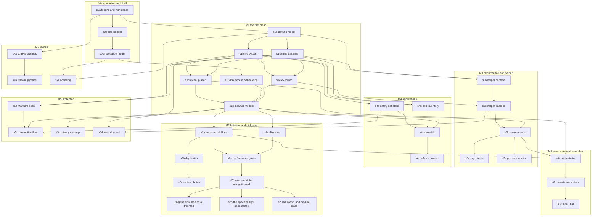

# Dependency Graph: MacGleam

Companion to CONTRACTS.md. Slices are thin vertical paths of user value,
mapped onto milestones M0 to M7 from ROADMAP.md. Each slice is sized so one
agent completes it within half a fresh context window. Contract numbers (C1 to
C39) refer to CONTRACTS.md.

Reading a slice entry:

- Depends on lists only real dependencies: the slice's tests cannot pass
  without them. Transitive dependencies are not repeated.
- Verification names the behaviour a test proves when the slice is done.
- Tier is auto (tests passing fully captures correctness) or verify (a human
  checks the named behaviour on a real machine before the slice closes).
  Every interface slice is verify because interaction quality is the product.

## Dependency diagram

Validated with the mermaid command line renderer on 2026-08-11.

The first wave (no dependencies beyond s0a) is wide on purpose: s0b, s1a and
s7a can start in parallel the moment the workspace exists.

---

## M0. Foundation and the shell

The two interface slices here shipped as the hexagonal hub. The rail replaced
that surface in s2f, so their entries below describe what survives, and their
human checks are retired without a verdict rather than left standing against a
screen nobody can open. DECISIONS.md carries the reversal and its reasons.

### s0a. tokens and workspace
- Contracts: C1, C2.
- Depends on: nothing.
- Includes the repo cut, the Swift package workspace and continuous
  integration with test and lint gates, folded in because infrastructure
  alone is not a slice.
- Verification: token values match the contract exactly (spring responses,
  damping, fade durations, grid unit); semantic colours pass the Web Content
  Accessibility Guidelines AA contrast threshold in both appearances; the
  Reduce Motion mapping returns a crossfade, never a spring; continuous
  integration runs the suite on a macOS runner and fails on an empty test run.
- Tier: auto.

### s0b. the shell model (shipped as the hub shell)
- Contracts: C36 (hub shell model), consuming C1, C2.
- Depends on: s0a.
- What survives: the model. The hexagon of six cards around a centre orb was
  deleted in s2f; the moods, the status line, the module summaries and the orb
  appearance resolver were not, and the rail's health light is the orb.
- Verification: the orb renders its two idle states (healthy, attention
  needed); mood, status line and summary derivation are pure functions of
  HubMachineState, driven in tests without any view; the appearance resolver
  is total over every mood and Reduce Motion pair and never returns a spring
  under Reduce Motion; the module order is the fixed HubModule order.
- Tier: was verify; the human check is retired without a verdict, because the
  hexagonal layout it asked about no longer exists (STATE.md). The orb's
  breathing and the two appearances carried into s2f's check. What is left of
  this slice stands on tests alone.

### s0c. the navigation model (shipped as the hub zoom)
- Contracts: C37, which this slice wrote as the hub navigation model and s2f
  rewrote as the rail navigation model. Consumes C1, C2, C36.
- Depends on: s0b.
- What survives: the navigation model and the zoom resolver. The card to
  module matched geometry zoom went with the hexagon in s2f; the zoom grammar
  itself did not, because Disk Map drills into folders with it (C39). s2f
  rewrote the rest of C37 into the rail. The slices downstream that depend on
  s0c depend on there being a navigation surface at all, which is why the edge
  outlives the zoom.
- Verification: the key transition is total and deterministic and drives every
  destination without a view; module state passes through untouched over any
  key sequence; Reduce Motion replaces the zoom with a crossfade and the zoom
  resolver never returns a spring under it.
- Tier: was verify; the human check is retired without a verdict, because the
  hub to module zoom it asked about no longer exists (STATE.md). The surviving
  zoom is judged where it is still used, in s2d and s2g.

## M1. The first clean

### s1a. domain model
- Contracts: C3, C4, C5, C6, C7, C8, C9, C10, C11, C12 (types and their
  invariants; no protocols implemented yet).
- Depends on: s0a.
- Verification: path normalisation and descendant checks; counter
  monotonicity; plan and confirmation matching rules; denylist pattern
  matching including descendant blocking; all types round trip through
  Codable losslessly.
- Tier: auto.

### s1b. file system
- Contracts: C13, C14, plus the in memory implementation every engine test
  uses and the real enumerator.
- Depends on: s1a.
- Verification: the in memory and real implementations pass one shared
  conformance suite; enumeration never yields a duplicate (volumeID, fileID)
  pair even when the platform repeats entries (the Sequoia regression test,
  driven by a repeating fake); inaccessible directories are reported, not
  thrown; cancellation stops promptly and mutates nothing; moves are atomic
  per item.
- Tier: auto.

### s1c. rules baseline
- Contracts: C19 (baseline load and signature verification), completing C10.
- Depends on: s1a.
- Verification: the embedded baseline loads and verifies; a tampered
  catalogue is rejected and current rules are untouched; a lower or equal
  version is rejected; the effective denylist is the union of baseline and
  catalogue and can never lose a baseline entry.
- Tier: auto.

### s1d. cleanup scan
- Contracts: C15, C20.
- Depends on: s1b, s1c.
- Verification: against fixture trees the engine finds each junk category
  with itemised paths; nothing risky is preselected even when a hostile
  catalogue says preselectable; degraded mode reports what was skipped;
  phases advance in order and counters only count up; scanning holds only
  the reading side of the file system.
- Tier: auto.

### s1e. executor
- Contracts: C16, C17 (user domain execution; helper routing lands in s3b).
- Depends on: s1b, s1c.
- Verification: operations run in order, atomically per item; a denylisted
  target is skipped and reported as such; a permanent plan without a
  matching confirmation is refused whole before anything runs; cancellation
  between items leaves completed items completed and reports exactly which
  is which; the report always arrives, whatever happened.
- Tier: auto.

### s1f. disk access onboarding
- Contracts: C32.
- Depends on: s0c.
- Verification: the flow advances by itself when the grant lands (driven by
  a fake monitor in tests); declining lands in degraded mode with the honest
  banner naming what is unavailable; the app never prompts on a schedule.
- Tier: verify. Human check: grant Full Disk Access in System Settings and
  watch the flow advance without touching the app.

### s1g. cleanup module
- Contracts: C38 (cleanup module model), wiring C15, C17, C20, C32, C35
  into the interface. Also implements C35 (settings store) since deletion
  mode is first exercised here.
- Depends on: s1d, s1e, s1f.
- Verification: the full first clean end to end against a fixture home:
  scan, review down to file paths, deselect, execute, result screen naming
  every outcome, files present in the Trash afterwards; empty state is the
  designed clean sweep, not a blank panel; permanent mode demands the counts
  confirmation. Carried through to what the user sees next: after execution
  the hub estimate reflects the reclaimed bytes.
- Tier: verify. Human check: run a real clean on a scratch account, restore
  a file from the Trash, confirm the choreography (staggered rows, fly to
  summary, ticking counter) uses only token motion.

## M2. Leftovers and Disk Map

M2 also carries the interface slices that landed with it: s2f to s2i, which
replaced the hub with the rail, the disk map with a treemap, and the derived
light appearance with a specified one. They were appended under M3 by the pull
requests that shipped them; they belong here, with the milestone whose work
they were done alongside.

### s2a. large and old files
- Contracts: C21 (large, old, downloads triage portions).
- Depends on: s1g.
- Verification: threshold edges are exact (threshold minus one byte or day
  is not a finding); thresholds honour Settings; downloads triage groups by
  the review rules; end to end removal through the shared executor lands in
  Trash.
- Tier: verify. Human check: the Leftovers module surface reads as the same
  design language as Cleanup.

### s2b. duplicates
- Contracts: C21 (duplicate sets).
- Depends on: s2a.
- Verification: sets group by full content hash, never by size alone; the
  kept copy is a member of every set, shown in review, and no generated plan
  targets it under any selection, attacked with hostile selections; at least
  one copy always survives.
- Tier: verify. Human check: resolve a duplicate set and confirm the kept
  copy is visibly named before anything moves.

### s2c. similar photos
- Contracts: C21 (similar photo sets).
- Depends on: s2b.
- Verification: sets contain only image files and never overlap; kept path
  mechanics identical to duplicates; non photo libraries produce no sets.
- Tier: verify. Human check: grouping quality on a real photo folder is
  useful rather than noisy.

### s2d. disk map
- Contracts: C22, C39 (disk map module model). Amends C5 (per path byte
  sizes on Finding) and the C6 and C21 wording that followed, retiring the
  s2b ScannedAllocationCache.
- Depends on: s1g.
- Verification: the map streams and node totals only ever grow, converging
  to true allocated totals; denylisted nodes render but cannot be selected;
  deleting from the map follows the Trash default through the shared
  executor; drill in uses the shared zoom grammar (the C37 appearance
  types); finding byte totals derive from the finding's own entries with no
  process wide cache; the s1a Finding pins named in C5's migration note are
  updated deliberately in this slice.
- Tier: verify. Human check: the map builds outward from the root while
  scanning, and drilling into a folder is one continuous motion rather than a
  cut. The hub this zoom was shared with is gone; the grammar is not, and the
  Disk Map is now the only place it runs.

### s2e. performance gates
- Contracts: amends C4 (itemCount), C5, C15 (ScanStreamPolicy, the streaming
  guarantee), C20, C21, C22 and C38 so findings stream as bounded batches;
  enforces the performance and streaming clauses of C20 and C22.
- Depends on: s2a, s2d.
- Verification: on a generated fixture of typical shape, the full Cleanup
  scan finishes under 60 seconds and the Disk Map under 30 on Apple
  silicon; peak resident memory during the largest scan stays under 500
  megabytes; the first finding and the first map node each arrive within two
  seconds of their run starting and within the first half of it; no finding
  carries more than ScanStreamPolicy.maximumFindingEntries entries; a
  fixture crossing ScanStreamPolicy.firstFindingCheckpointFiles proves a
  sparse category streams its first finding mid walk rather than at the end;
  a category's paths, file count and byte total are the sums across its
  findings; the gates run in continuous integration and fail on regression.
  The C15 migration note lists the existing pins this breaks.
- Tier: auto.

### s2f. Lumina tokens and the navigation rail
- Contracts: rewrites C1 (the Lumina Utility palette, eight text roles, three
  nested radii, elevation with real values, the 4 point half step) and C37
  (HubDestination, the rail resolver, ModulePane and its resolver). Renames
  C36's HubCard to HubModuleSummary and cardFigures to moduleFigures.
- Depends on: s2e.
- Verification: every specified colour resolves to its hex; every text role
  carries its size, tracking and line height; the rail reaches every
  destination with up and down alone and clamps at both ends; left and right
  no longer move the selection and no transition carries a zoom; a pane
  carries an action exactly when its module is built and a not ready note
  exactly when it is not; the module's live figure lands on its first job and
  nowhere else.
- Tier: verify. Human check: the rail and the pane read as one app, and every
  module opens on the same shape.

### s2g. the disk map as a treemap
- Contracts: adds TreemapLayout to C39's module surface.
- Depends on: s2f.
- Verification: tile area matches weight share; tiles never overlap, stay
  inside the canvas and tile it exactly; a small entry beside a dominant one
  keeps both a width and a height; equal weights come out close to square.
- Tier: verify. Human check: a folder holding almost everything no longer
  hides the rest, and drilling in from a tile feels the same as from the list.

### s2h. the specified light appearance
- Contracts: amends C1 (light values come from the Clinical Precision
  specification; GleamElevation becomes appearance aware and returns an edge
  colour and a shadow rather than bare numbers).
- Depends on: s2f.
- Verification: every specified light token resolves to its hex; no token is
  the same colour in both appearances; a resting card casts nothing in dark
  and something in light; each appearance's named shadows match; a light
  shadow is cast in the text navy and a dark one in black.
- Tier: verify. Human check: the light appearance reads as deliberate rather
  than as the dark one with the lights turned up.
- Two of those five had no test at the 2026-08-11 reconciliation, so they were
  not read as done: light was not asserted hex for hex the way dark is, resting
  instead on the contrast matrix, the named shadows and the named edge, and
  nothing asserted that a token differs between the two appearances. Both are
  unfinished verification of shipped values, not unfinished values. Both were
  closed on 2026-08-11: light is now pinned hex for hex where the specification
  names a value and pinned as a shipping value where it does not, and a test
  asserts no token resolves to the same colour in both appearances.

### s2i. the rail's intents and preserved module state
- Contracts: C37 (HubIntent reaching the pane, ModuleStateSlot and
  storingSlot), consuming C38 and C39 for the panes that act on an intent.
- Depends on: s2f.
- Why it exists: C37 specifies both and, as of 2026-08-11, neither is wired in
  anything that has merged. The resolver returns an intent for return and
  escape and nothing reads it, so the shell consumes both keys and does
  nothing with them; `storingSlot` has no caller outside the tests, so module
  state does not survive navigation. The first is a live defect a keyboard
  only user hit, and it was closed on 2026-08-11 through `HubKeyResolver`,
  which claims a press only when it moves the rail or carries an intent the
  open pane can run. What remains of this slice is the module state half.
- Verification: return over a built module runs that pane's primary action and
  escape dismisses whatever the pane has open, both driven through the shell
  rather than asserted at the resolver; a key the open pane does not use is
  reported unhandled rather than swallowed, so the system beep and the
  responder chain still work; leaving a module and coming back restores what
  the module put in its slot, proved through the shell for at least Cleanup
  and Disk Map, with the slot round trip carried to what the user sees next
  rather than stopping at the store; a module with nothing to preserve stores
  nothing and is unaffected.
- Tier: verify. Human check: drive the whole app with the keyboard alone,
  starting a scan and dismissing a result without touching the pointer, and
  confirm a review selection survives navigating away and back.

## M3. Performance and the privileged helper

### s3a. helper contract
- Contracts: C30, C31 (types, policy, contract tests against a test double
  transport). Also lands C24's LaunchItemChange in GleamCore as a plain value
  type, because C30's launchItemChanged reply carries it; the behaviour around
  it stays in s3d.
- Depends on: s1a, s1c.
- Verification: every message round trips the wire encoding losslessly; the
  policy refuses in the contract's evaluation order (identity, handshake,
  domain, denylist) with the right refusal each time; a user domain target
  is refused notSystemDomain; a denylisted target is refused whatever the
  request claims; version mismatch refuses everything after handshake, and
  the handshake refusal names both versions so the app can say which side is
  behind; a request arriving before any handshake is refused versionMismatch;
  a launch item the helper cannot resolve is refused malformedRequest.
- Tier: auto.

### s3b. helper daemon
- Contracts: implements C30, C31 in the real daemon; extends C17 with helper
  routing.
- Depends on: s3a, s1e.
- Verification: contract tests pass against the real daemon on a real
  machine; the executor routes systemDomain operations to the helper and
  validates replies; a malformed reply fails the one operation, not the run;
  the helper is registered lazily on first privileged need, never at first
  launch.
- Tier: verify. Human check: first privileged operation triggers the System
  Settings approval exactly once, and the app degrades honestly if approval
  is refused.

### s3c. maintenance
- Contracts: C23 (maintenance portion), first real helper consumer;
  amends C5 (a maintenance finding carries no path entries, plus the
  `maintenanceTask` category), C4 (itemCount for a pathless finding),
  C7, C15 and C29.
- Depends on: s3b, s1g.
- Verification: each maintenance task runs through the helper and is
  idempotent; tasks that clear user visible data say so before running; no
  PerformanceEngine plan ever contains a file removal operation; a
  maintenance finding carries no path entries, so its `paths` is empty
  and its `byteSize` is zero, asserted over every MaintenanceTask case
  and over the whole generated plan space rather than over the tasks a
  test happens to name; no finding whose task has `clearsUserVisibleData`
  true is ever preselected and no Full Sweep plan ever contains one,
  asserted over the flag so a task added later is covered without a new
  test.
- Tier: verify. Human check: the Domain Name System cache flush arrives
  deselected, and running it deliberately shows the warning sentence
  first.

### s3d. login items
- Contracts: C24, C23 (login item portion). LaunchItemID and LaunchItemChange
  already exist as value types (s1a, s3a); this slice gives them behaviour.
- Depends on: s3c.
- Verification: inventory attributes items to owning apps; disable then re
  enable round trips through the recorded prior state and survives relaunch;
  user scope changes stay in process, system scope routes through the
  helper; disable never deletes.
- Tier: verify. Human check: disable a known login item, log out and in,
  confirm it did not launch, re enable with one click.

### s3e. process monitor
- Contracts: C25.
- Depends on: s3c.
- Verification: samples stream sorted heaviest first without blocking the
  main actor; quit demands the confirmation path and force is a second
  separate confirmation; a recycled process identifier is caught by the name
  check and nothing is killed.
- Tier: verify. Human check: the live view updates smoothly and quitting a
  test process names it in the confirmation.

## M4. Applications

### s4a. safety net store
- Contracts: C18 in full.
- Depends on: s1b.
- Verification: store strips execute permission and preserves extended
  attributes; restore reinstates path, permissions, attributes and dates
  exactly (fidelity asserted attribute by attribute); an occupied origin
  refuses and changes nothing; group restore is all or nothing; expiry marks
  eligibility only and purge demands matching counts; the manifest survives
  simulated app removal and reinstall.
- Tier: auto.

### s4b. app inventory
- Contracts: C9, C26 (inventory portion).
- Depends on: s1b, s1c.
- Verification: discovery against fixture bundles finds the app and each
  leftover kind; the association rule survives the adversarial fixtures
  (shared containers, colliding bundle identifier prefixes) without a single
  false association; MacGleam itself is never offered.
- Tier: auto.

### s4c. uninstall
- Contracts: C26 (uninstall), consuming C18.
- Depends on: s4a, s4b, s1g.
- Verification: an uninstall plan contains only archive operations under one
  group; after execution every file sits in SafetyNet and the app is gone;
  group restore reinstates every file at its original path; no uninstall
  plan can contain a trash or permanent operation.
- Tier: verify. Human check: uninstall a scratch app, watch the gather
  choreography present it as one reversible unit, restore it, launch it.

### s4d. leftover sweep
- Contracts: C26 (orphan sweep).
- Depends on: s4c.
- Verification: orphans from deleted fixture apps are found, never
  preselected, and removal follows the Trash default; files belonging to
  installed apps are never flagged as orphans.
- Tier: verify. Human check: sweep a real machine and read the findings for
  false positives before acting.

## M5. Protection

### s5a. malware scan
- Contracts: C27 (detection portion), C28.
- Depends on: s1b, s1c.
- Verification: seeded fixture binaries matching test YARA rules are found
  with their signature identifiers; adware launch items, extensions and
  unwanted paths from the curated list are found; one failing rule disables
  itself without sinking the scan; a detection plan contains only quarantine
  operations, proven over the generated plan space.
- Tier: auto.

### s5b. quarantine flow
- Contracts: C27 wired to C18 and the interface.
- Depends on: s5a, s4a, s1g.
- Verification: a detection quarantines into SafetyNet with execute
  permission stripped; one click restore within 30 days reinstates it;
  purge demands confirmation; nothing is ever silently deleted, asserted
  end to end.
- Tier: verify. Human check: quarantine a European Institute for Computer
  Antivirus Research test file, confirm it cannot execute from the store,
  restore it, confirm fidelity.

### s5c. privacy cleanup
- Contracts: C27 (privacy portion).
- Depends on: s1g.
- Verification: findings per browser and per data kind, none preselected;
  each removal clears exactly the selected item against fixture browser
  profiles; explanations name what is cleared.
- Tier: verify. Human check: clear one browser's cookies on a scratch
  profile and confirm history survived.

### s5d. rules channel
- Contracts: C19 (live channel), the channel publish workflow, helper
  catalogue adoption per C31.
- Depends on: s1c, s3b.
- Verification: a published update is fetched, verified and adopted; a
  tampered or replayed (older version) manifest is rejected leaving current
  rules intact; the helper only honours a catalogue it verified itself; the
  publish workflow signs with the rules key held only in that pipeline.
- Tier: auto.

## M6. Full Sweep and the menu bar

### s6a. orchestrator
- Contracts: C29.
- Depends on: s1d, s2a, s3c.
- Verification: three jobs run concurrently with interleaved tagged events;
  one job failing leaves the other two fully usable and named in the
  summary; exactly one summary, after all jobs; the combined plan preserves
  every underlying engine invariant; no stub job can appear (the enum is the
  proof).
- Tier: auto.

### s6b. smart care surface
- Contracts: wires C29 to the hub; the orb's scanning, result and clean
  sweep states go live.
- Depends on: s6a.
- Verification: one combined result with per job detail and deselection;
  the orb reflects scanning (shimmer, live byte counter, non scanned cards
  dimmed), result (single lively pulse, particles here and nowhere else)
  and clean sweep; Reduce Motion swaps the shimmer for a determinate ring.
- Tier: verify. Human check: run Full Sweep on a scratch account and judge
  the scene against the DESIGN.md choreography, including the empty result
  as a reward moment.

### s6c. menu bar
- Contracts: C33, the menu bar scene.
- Depends on: s6b.
- Verification: storage, memory and processor figures stream and agree with
  the hub's figures; the quick clean action opens the app onto Full Sweep;
  the scene honours the menu bar preferences in Settings.
- Tier: verify. Human check: glanceability and footprint; the popover sizes
  correctly (the known AppKit interop seam).

## M7. Launch

### s7a. sparkle updates
- Contracts: Sparkle 2 integration, beta and stable appcast channels, the
  EdDSA appcast keys in the pipeline. No new package contracts; the
  no exfiltration invariant (CONTRACTS.md cross contract section) now covers
  the third permitted endpoint.
- Depends on: s0a.
- Verification: an update from the beta channel installs and relaunches; a
  tampered appcast entry is rejected; the appcast is one of exactly three
  outbound endpoints.
- Tier: verify. Human check: update a versioned build from the beta channel
  on a real machine.

### s7b. release pipeline
- Contracts: none new; the deployment section of DESIGN.md becomes a
  workflow.
- Depends on: s7a.
- Verification: on tag, continuous integration archives, signs app and
  helper, notarizes, staples, builds the disk image and publishes the
  signed appcast entry; the built artefact passes Gatekeeper assessment on
  a clean machine; no signing key ever exists on a laptop; the build fails
  when ExpectedClientIdentity.macGleamApp (C31) does not carry the Developer
  ID team identifier, so the helper's client check cannot ship as a
  formality.
- Tier: auto.

### s7c. licensing
- Contracts: C34, completing C11.
- Depends on: s0c, s1a.
- Verification: trial boundaries against a controlled clock (day 14 versus
  day 15); verify is offline and network independent; activation exchanges
  a key for a signed licence and server failure leaves state untouched; no
  feature gate exists during trial, asserted by walking every module entry
  point in the trial state.
- Tier: verify. Human check: the trial and purchase surfaces read honestly,
  no dark patterns.

Launch also carries non engineering work with no contracts: the trademark
search resolving the MacGleam name, the branding pass, the website and
purchase flow. Tracked in ROADMAP.md, outside this graph.

---

## Open questions found while typing the design

Ambiguities and contradictions in DESIGN.md surfaced by writing the
contracts. Each names the resolution typed into CONTRACTS.md so reversing it
is one edit, not an archaeology dig.

1. Trash destination for system domain paths. Cleanup defaults to the Trash,
   but junk outside the user domain is removed by the root helper, and which
   Trash receives a root owned file (and with what ownership) is undefined
   in the design. Typed: the helper takes an explicit destination
   (C30, HelperRemovalDestination) including userTrash with ownership
   transfer. Whether root owned items should honour the Trash default at all
   needs a decision.
2. Settings lists scan schedules while scheduled background scanning is
   deferred to post launch. Typed: schedules omitted from C12. If the field
   was meant as forward provision, say so in DECISIONS.md.
3. Preselection for Protection findings. The design forbids preselecting
   risky items in Cleanup but is silent for malware. Typed: malware and
   adware findings are preselected because quarantine is reversible; privacy
   items never are. This is my resolution, not a stated decision.
4. Keep one invariant for similar photos. Stated only for duplicates. Typed:
   the same kept path mechanics apply to similar photo sets (C21).
5. Where the prior state of a login item change is recorded. The design says
   recorded per change but not where. Typed: LaunchItemChange records
   persisted by the app (C24). If they should live in SafetyNet for the
   shared retention story, C18 needs a third source case.
6. Helper denylist updates. The design wants the denylist enforced
   independently in both processes so a bad rules update cannot cross it,
   but does not say whether the helper adopts catalogue updates. Typed: each
   process unions the embedded baseline with only catalogues it verified
   itself, and updates can extend but never shrink the denylist (C10, C31).
7. Path ownership of external volumes and other users' files. Typed:
   userDomain means mutable without privilege escalation (C16), which puts
   user writable external volumes in the user domain. Edge cases (another
   user's home on the same machine, network volumes) follow the same rule
   but deserve a look.
8. The menu bar quick clean action "opens the app on the Full Sweep result".
   Ambiguous between starting a scan and showing the last result. Typed:
   the action starts a Full Sweep scan and opens the window onto its
   progress, landing on the result (s6c).
9. Byte size semantics. Reclaimable estimates need allocated (on disk)
   bytes; the design never says logical or physical. Typed: allocated bytes
   everywhere (C5, C13), so sparse and cloned files do not inflate the
   promise.
10. Trial persistence across reinstall. A 14 day trial whose record dies
    with the app folder resets on reinstall. Typed: the trial record
    survives where possible and never moves backwards (C34). Resolved
    2026-08-09: surviving reinstall is a goal. The trial start lives in
    Application Support beside the SafetyNet manifest, which already
    carries the reinstall survival requirement.
