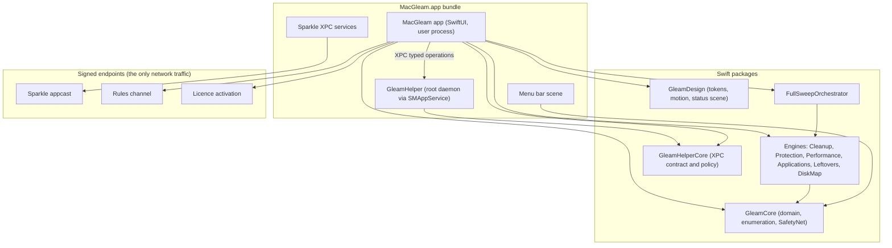

# Roadmap: MacGleam

Companion to DESIGN.md. Milestones are ordered vertical slices of user value;
the architect turns each into contracts and a dependency graph. The diagram
below was validated with the mermaid command line renderer on 2026-08-09.

## Architecture

## Milestones

**M0. Foundation and the hub shell**
- Repo cut from the ideas folder, Swift package workspace, continuous
  integration on a GitHub Actions macOS runner with test and lint gates.
- GleamDesign package: colour, type, spacing and motion tokens; the spring set.
- Hub window with the status scene in its idle states and six placeholder
  cards; matched geometry zoom in and out working end to end with keyboard
  navigation and Reduce Motion fallback.
- Slices here prove the signature interaction before any cleaning exists.

**M1. The first clean**
- Full Disk Access onboarding flow with live grant detection and the degraded
  mode banner.
- GleamCore enumeration engine (getattrlistbulk, bounded concurrency, file id
  deduplication) with fixture based tests.
- Cleanup module end to end: system junk and trash bin scan, itemised review,
  move to Trash execution, atomic plan executor, result and empty states with
  their choreography.
- Rules bundle v1 (baseline safe path catalogue and denylist, enforced in the
  executor).
- Exit: a user can scan, review and reclaim space, and undo from the Trash.

**M2. Leftovers and Disk Map**
- Leftovers: large and old files, downloads triage, duplicates by content
  hash (keep one copy invariant), similar photos.
- Disk Map: streaming disk map with the shared zoom grammar.
- Scan performance targets from DESIGN.md are measured and enforced in tests
  here, since these are the heaviest scans.

**M3. Performance and the privileged helper**
- GleamHelper: SMAppService daemon registration flow, XPC contract in
  GleamHelperCore, client identity verification, denylist enforcement in the
  helper, contract tests against a test double and the real daemon.
- Performance module: maintenance tasks, login and background items with
  disable and re enable, live memory and processor view with confirmed quit.
- Exit: root operations exist and are provably least privilege.

**M4. Applications**
- App inventory, full uninstall with leftover sweep, SafetyNet archive and
  restore for uninstalls, orphaned leftover finder.
- SafetyNet store graduates to its full contract: 30 day retention, restore
  fidelity (paths, permissions, extended attributes), reinstall survival.

**M5. Protection**
- Vendored YARA build, scan engine over the XProtect published rules plus the
  curated adware list, quarantine into SafetyNet, restore and purge flows.
- Privacy cleanup (browsers, recent lists, Wi-Fi history), all opt in per item.
- Signed rules channel live: Ed25519 manifest, independent publish workflow.

**M6. Full Sweep and the menu bar**
- FullSweepOrchestrator composing deep clean, storage deleftovers and
  performance boost into one scan, one combined result, per job detail.
- Menu bar scene: storage, memory, processor, one quick clean action.
- The status scene now reflects live Full Sweep state across all its moods.

**M7. Launch**
- Sparkle 2 integration, beta then stable appcast channels, EdDSA keys in the
  release pipeline.
- Signing, notarization, stapling and disk image build in continuous
  integration on tag.
- Licensing: 14 day trial, signed licence file, activation endpoint, payment
  processor integration (likely Paddle).
- Trademark search resolves the MacGleam name; final branding pass; website and
  purchase flow.

## Product roadmap beyond launch

- Application updater, then Full Sweep jobs four (software updates) and five
  (threat scan folded into the combined scan).
- Cloud Cleanup module.
- Assistant and suggestions layer fed by real usage.
- Scheduled background scanning and richer menu bar stats (battery, network).
- Localisation, and a commercial signature feed if the open rules approach
  proves insufficient in the field.
